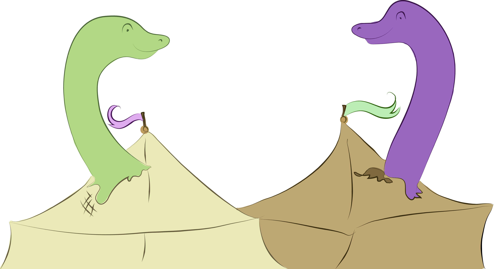
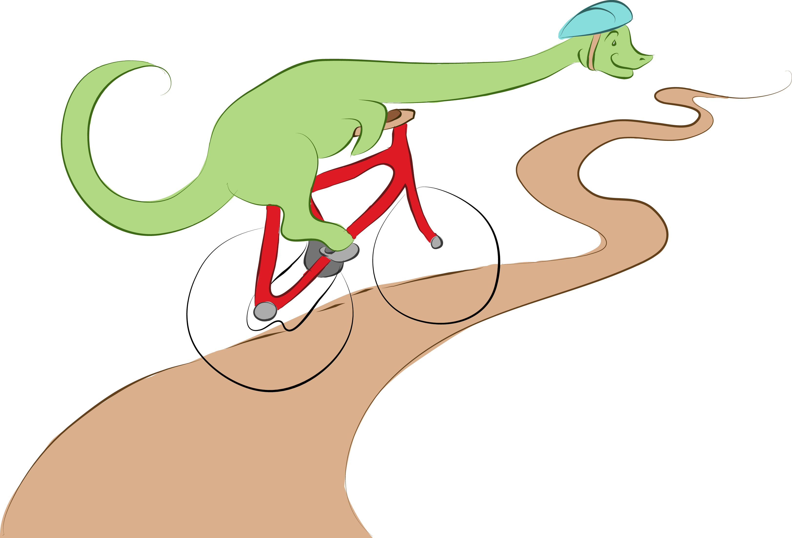

# unbazaar

!SLIDE

# unbazaar

an unhosted marketplace for local production

!SLIDE

# 1. introduction

!SLIDE

# unbazaar is a

- peer-to-peer
- open source
- currency agnostic

## marketplace

!SLIDE left

# peer-to-peer
## <http://unhosted.org>

    also known as "serverless", "client-side", or "static" web apps, unhosted web apps do not send your user data to their server. either you connect your own server at runtime, or your data stays within the browser.

- we offer web application
  - works on any device, no matter which platform or provider
- web app uses per-user data storage
  - each user has independent data storage
  - same data storage works on other unhosted web apps
- web app scales to infinite number of users at no additional backend cost

!SLIDE left

# open source

- paradigm shift for development
  - [open rather than closed](http://www.catb.org/esr/writings/homesteading/)
- we target early [open source economy](http://opensourceecology.org/wiki/Open_Source_Ecology_Paradigm)
- our software licensed under [AGPL](http://www.gnu.org/licenses/agpl.html) ([copyleft](http://www.gnu.org/copyleft/))

!SLIDE left

# currency-agnostic
## <https://payswarm.com/>

- universal payment standard for the web
  - patent-free, royalty-free, based on open technology
- allows transactions of any currency
- reduces fees for making transactions

!SLIDE left

# ecosystem of marketplace

- source nodes are producers
- sink nodes are consumers
- other nodes are third-party intermediaries
   - distributers, vendors, ...
- we want to make it easy for anyone to fulfill any role within the marketplace

TODO: make visual graph

!SLIDE

# 2. target market

[open source economy](http://opensourceecology.org/wiki/Open_Source_Ecology_Paradigm)

!SLIDE left

# consider
## this set of production equipment

- 3d printers
- laser cutters 
- cnc machines

!SLIDE left

# historically

- expensive and closed source
- required significant investment
- only used for large-scale manufacturing
- found in small number of production factories

!SLIDE left

# now

- cheap and open source
  - 3d printing
    - <http://www.reprap.org/wiki/RepRap_Options#Models>
    - <http://www.makexyz.com/>
  - laser cutters
    - <http://labs.nortd.com/lasersaur/>
  - cnc machines
    - <http://www.shapeoko.com/>
- within budget of everday consumers
- capable of large number of production microfactories

!SLIDE left

# but personal equipment
## left idle

- aside from occasional projects, personal equipment spends most of its time idle
- huge loss of equipment potential
- high demand for possible production
  - 3d printed parts
  - furniture
  - art
  - other things found on [thingiverse](http://www.thingiverse.com), [shapeways](http://www.shapeways.com/)

!SLIDE left

# the goal of unbazaar
## connect consumers with local producers

- producers list equipment
  - equipment does bulk of work
  - helps repay initial equpiment cost
- consumers find equipment
  - less distance for shipping
  - competitive with existing prices
  - supports local business

!SLIDE left

# target audience
## early adopters

- hackerspaces
  - most have production equipment
    - 3d printers > laser cutters > cnc machines
  - [list of hackerspaces](http://hackerspaces.org/wiki/List_of_Hacker_Spaces)
- members of hackerspaces
  - comfortable with bleeding edge systems (willing to go beyond status quo)
  - many have production equipment
  - many have already contributed to open source

!SLIDE

# 3. technical overview

!SLIDE left

# components of unbazaar

- remoteStorage => per-user data
  - <http://remotestorage.io/>
- backbonejs => model / view
  - <http://backbonejs.org/>
- requirejs => module loader
  - <http://requirejs.org/>
- Web Payments => currency exchange
  - <http://web-payments.github.io/browser-payments/>
  - <https://payswarm.com/specs/source/web-payments>
- Web Commerce => asset listings
  - <https://payswarm.com/specs/source/web-commerce>
- sockethub => social media
  - <http://sockethub.org/>
- Payment Intents => crowdfunding
  - <https://payswarm.com/specs/source/payment-intents>

!SLIDE

# 4. roadmap
## fibonacci steps

!SLIDE left

# one

- clone [makexyz](http://makexyz.com) listings with unhosted remoteStorage
  - unhost user tools (Web Commerce asset)
  - make index that searches users by location, tool
- bounties:
  - <https://groups.google.com/forum/?fromgroups=#!topic/unhosted/SpB_i6md0Ro>

!SLIDE left

# two

- add user reputation

!SLIDE left

# three

- add payments
  - unhost listings (Web Commerce listings)

!SLIDE left

# five

- add other tools
  - laser cutters
  - cnc machines

!SLIDE left

# eight

- add bill of materials
  - unhost materials (Web Commerce asset)
  - make index that searches users by location, material

!SLIDE left

# thirteen

- add assembly services
  - unhost user recipes (Web Commerce asset)
  - make index that searches users by location, recipe

!SLIDE left

# unstaged

- add sponsorship for designs
- add editor for designs
- add delivery services
- add computer to tools
